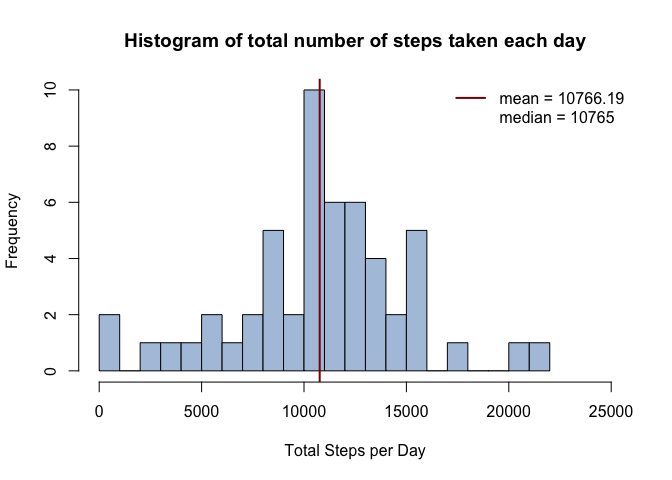
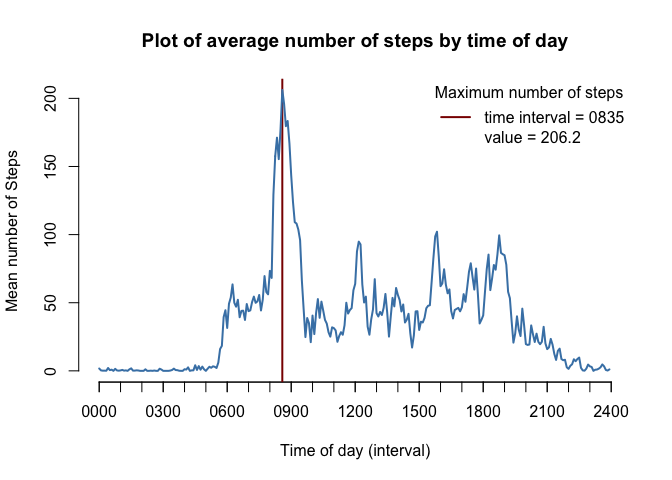
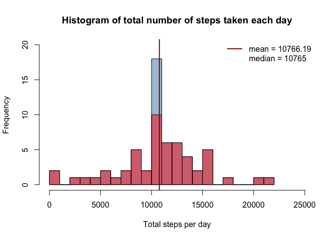
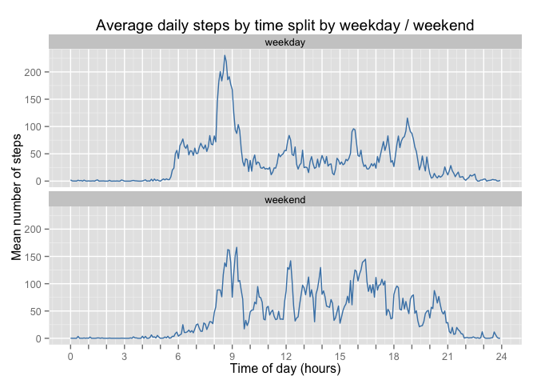

# Reproducible Research: Peer Assessment 1
George F. Dorsey, Jr.  
***
  
## Loading and preprocessing the data

The unzipped [activity.csv](activity.csv) file should be located in the working directory.  The file is read into the $activity$ variable and tidied a bit by first converting the date column to a Date type.


```r
activity <- read.csv("activity.csv")
activity$date <- as.Date(activity$date, format="%Y-%m-%d")
```
  
  
Next, a function is defined to convert the interval strings into real-valued continuous hours.  This will be useful when plotting the intervals on the x-axis to avoid the discontinuity between intervals xx55 and yy00 when represented as numbers.


```r
convertInterval <- function(x) {
    hour <- floor(x/100)
    minute <- x %% 100
    hour + minute / 60.0
}

activity$hours <- convertInterval(activity$interval)

str(activity)
```

```
## 'data.frame':	17568 obs. of  4 variables:
##  $ steps   : int  NA NA NA NA NA NA NA NA NA NA ...
##  $ date    : Date, format: "2012-10-01" "2012-10-01" ...
##  $ interval: int  0 5 10 15 20 25 30 35 40 45 ...
##  $ hours   : num  0 0.0833 0.1667 0.25 0.3333 ...
```

```r
summary(activity)
```

```
##      steps             date               interval          hours       
##  Min.   :  0.00   Min.   :2012-10-01   Min.   :   0.0   Min.   : 0.000  
##  1st Qu.:  0.00   1st Qu.:2012-10-16   1st Qu.: 588.8   1st Qu.: 5.979  
##  Median :  0.00   Median :2012-10-31   Median :1177.5   Median :11.958  
##  Mean   : 37.38   Mean   :2012-10-31   Mean   :1177.5   Mean   :11.958  
##  3rd Qu.: 12.00   3rd Qu.:2012-11-15   3rd Qu.:1766.2   3rd Qu.:17.938  
##  Max.   :806.00   Max.   :2012-11-30   Max.   :2355.0   Max.   :23.917  
##  NA's   :2304
```
  
***
  
## What is mean total number of steps taken per day?

Using the ddply function of the plyr library, the total number of steps per day are calculated and displayed as a histogram.  The mean and median values are also calculated and shown on the plot, and the mean is marked with a vertical line for reference.


```r
library(plyr)

sum.by.date <- ddply(activity, .(date), summarize, sumsteps=sum(steps))
mean.steps.per.day = round(mean(sum.by.date$sumsteps, na.rm = TRUE),2)
median.steps.per.day = median(sum.by.date$sumsteps, na.rm = TRUE)

hist(sum.by.date$sumsteps, breaks = 20,
        main = "Histogram of total number of steps taken each day",
        xlim = c(0, 25000), col = "lightsteelblue",
        xlab = "Total Steps per Day", ylab = "Frequency")
abline(v = mean.steps.per.day, col = "darkred", lwd = 2)
legend("topright", c(paste("mean =", format(mean.steps.per.day, 1)),
        paste("median =", median.steps.per.day)), col = c("darkred", "white"),
        lwd = 2, bty="n", bg="white")
```

 
  
***
  
## What is the average daily activity pattern?

For this question, we want to look at each interval instead of each day, so again using the aggregate function of the plyr library, we can average across all of the days.  To avoid the discontinuity between the intervals ending in 55 and the next interval ending in 00, the hours column calculated above is used to represent the interval on the x-axis.


```r
#library(plyr)

mean.by.hours <- ddply(activity, .(hours), summarize,
        meansteps = mean(steps, na.rm = TRUE))

# find point of maximum and get interval (based on hour) and value
index = which(mean.by.hours$meansteps == max(mean.by.hours$meansteps))
time.of.max = mean.by.hours$hours[index]
interval.of.max = 100 * trunc(time.of.max) +
        60 * (time.of.max - trunc(time.of.max))
value.of.max = mean.by.hours$meansteps[index]

plot(mean.by.hours, type = 'n',
        main = "Plot of average number of steps by time of day",
        xlab = "Time of day (hours)", ylab = "Mean number of Steps",
        xlim = c(0,24), xaxp = c(0, 24, 8))
axis(1, xaxp = c(0, 24, 24), labels = FALSE)
abline(v = time.of.max, col = "darkred", lwd = 2)
lines(mean.by.hours, col = "steelblue", lwd = 2)
legend("topright", c(sprintf("time interval = %04d", interval.of.max),
        sprintf("value = %.1f", value.of.max, 1)),
        title = "Maximum number of steps",
        col = c("darkred", "white"), lwd = 2, bty="n", bg="white")
```

 
  
***
  
## Imputing missing values

Using either the summary shown in the first panel or the sum below, we see that there are 2304 NA values.


```r
invalidRows <- is.na(activity$steps)
sum(invalidRows)
```

```
## [1] 2304
```
  
  
The method I've chosen to impute the missing values is to use the mean for the same time period for the other days.


```r
activity.imputed <- activity
indices = which(invalidRows)
hours = activity$hours[invalidRows]
means = mean.by.hours$meansteps[match(hours, mean.by.hours$hours)]
activity.imputed$steps[indices] = means
summary(activity.imputed)
```

```
##      steps             date               interval          hours       
##  Min.   :  0.00   Min.   :2012-10-01   Min.   :   0.0   Min.   : 0.000  
##  1st Qu.:  0.00   1st Qu.:2012-10-16   1st Qu.: 588.8   1st Qu.: 5.979  
##  Median :  0.00   Median :2012-10-31   Median :1177.5   Median :11.958  
##  Mean   : 37.38   Mean   :2012-10-31   Mean   :1177.5   Mean   :11.958  
##  3rd Qu.: 27.00   3rd Qu.:2012-11-15   3rd Qu.:1766.2   3rd Qu.:17.938  
##  Max.   :806.00   Max.   :2012-11-30   Max.   :2355.0   Max.   :23.917
```
  
  
The data are then plotted as before, with the earlier data shown in red and the new data with imputed values shown in blue.  Not surprisingly since entire days appear to be missing from the original data set, this approach appears to bias the imputed values toward the mean, so that the mean and median don't change for the imputed data set relative to the original data set, and there is a large increase in the frequency of the bucket containing the mean number of steps.


```r
#library(plyr)

sum.by.date.imputed <- ddply(activity.imputed, .(date), summarize,
        sumsteps=sum(steps))
mean.steps.per.day = round(mean(sum.by.date$sumsteps, na.rm = TRUE),2)
median.steps.per.day = round(median(sum.by.date$sumsteps, na.rm = TRUE),2)

hist(sum.by.date.imputed$sumsteps, breaks = 20,
        main = "Histogram of total number of steps taken each day",
        xlim = c(0, 25000), ylim = c(0, 20), col = rgb(0.27, 0.51, 0.71, 0.5),
        xlab = "Total steps per day", ylab = "Frequency")
hist(sum.by.date$sumsteps, breaks = 20,
        xlim = c(0, 25000), col = rgb(1, 0, 0, 0.5), add = TRUE)
abline(v = mean.steps.per.day, col = "darkred", lwd = 2)
legend("topright", c(paste("mean =", format(mean.steps.per.day, 1)),
        paste("median =", median.steps.per.day)), col = c("darkred", "white"),
        lwd = 2, bty="n", bg="white")
```

 

  
***
  
## Are there differences in activity patterns between weekdays and weekends?

First, the day names are determined using the weekdays function.  Then a factor is created to label a  day as weekend or weekday (work day).


```r
activity.imputed$day = weekdays(activity.imputed$date)
weekend = activity.imputed$day == "Saturday" | activity.imputed$day == "Sunday"
activity.imputed$weekday = factor(ifelse(weekend, "weekend", "weekday"))
summary(activity.imputed)
```

```
##      steps             date               interval          hours       
##  Min.   :  0.00   Min.   :2012-10-01   Min.   :   0.0   Min.   : 0.000  
##  1st Qu.:  0.00   1st Qu.:2012-10-16   1st Qu.: 588.8   1st Qu.: 5.979  
##  Median :  0.00   Median :2012-10-31   Median :1177.5   Median :11.958  
##  Mean   : 37.38   Mean   :2012-10-31   Mean   :1177.5   Mean   :11.958  
##  3rd Qu.: 27.00   3rd Qu.:2012-11-15   3rd Qu.:1766.2   3rd Qu.:17.938  
##  Max.   :806.00   Max.   :2012-11-30   Max.   :2355.0   Max.   :23.917  
##      day               weekday     
##  Length:17568       weekday:12960  
##  Class :character   weekend: 4608  
##  Mode  :character                  
##                                    
##                                    
## 
```
  
  
Next, the data are summarized by the mean of the values split by hours (time interval) and weekday, and those data are plotted separately for weekday and weekend.  Some differences that can be observed are that the activity tends to peak higher on weekdays(230) vs weekends (166), but the total activity appears to be a bit more.  Also above a certain threshold, say 50 steps per 5-minute period, activity appears to start and end later on weekends.


```r
# library(plyr)
library(ggplot2)

mean.by.hours.split <- ddply(activity.imputed, .(hours,weekday), summarize,
        meansteps = mean(steps, na.rm = TRUE))

max(mean.by.hours.split[mean.by.hours.split$weekday == "weekday","meansteps"])
```

```
## [1] 230.3782
```

```r
max(mean.by.hours.split[mean.by.hours.split$weekday == "weekend","meansteps"])
```

```
## [1] 166.6392
```

```r
xlabs <- seq(0,24)
xlabs[xlabs %% 3 != 0] <- ""
g <- ggplot(mean.by.hours.split, aes(hours, meansteps)) +
        geom_line(color = "steelblue") +
        facet_wrap(~weekday, nrow = 2) +
        labs(title = "Average daily steps by time split by weekday / weekend",
        x = "Time of day (hours)", y = "Mean number of steps") +
        scale_x_continuous(breaks = seq(0,24), labels = xlabs)
g
```

 
  
  
